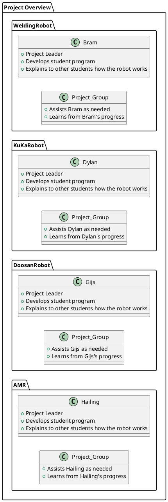
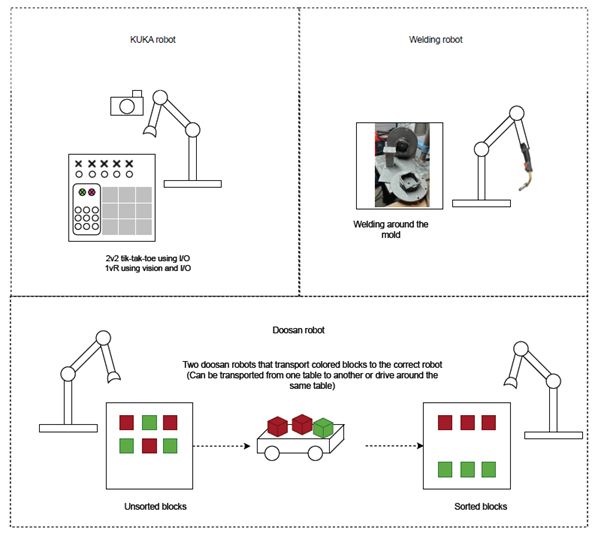

# Task Overview
This document outlines the structure of a collaborative project involving multiple robotic systems. 
Each robot is assigned to a student who serves as the project leader, responsible for developing a guide for the group and explaining the robot's functionality. 
The project focuses on four robots: WeldingRobot, KuKaRobot, DoosanRobot, and AMR. 
For each robot, the assigned student leads development, explains the robot's operation, and collaborates with their project group, which provides assistance and gains knowledge throughout the process.

## Project distribution
The diagram represents a project with four robot systems: WeldingRobot, KuKaRobot, DoosanRobot, and AMR. Each system has a project leader (Bram, Dylan, Gijs, and Hailing) who develops the student program and explains it to others. The project groups assist the leaders and learn from their progress.

## Indivisual project overview
The diagram represents a project with three robot systems: KUKA, Welding, and Doosan.

Right now we are at the beginning of the project. The plan for now is to do the following:

* KUKA: Plays tic-tac-toe with the project leader and teaches others how the game works.
* Welding: Focuses on welding tasks, with the leader developing the program and explaining it to others.
* Doosan: Picks and places blocks, sorting them by colors, with the leader guiding and teaching the process.

Each project group assists their leader and learns from their progress.

