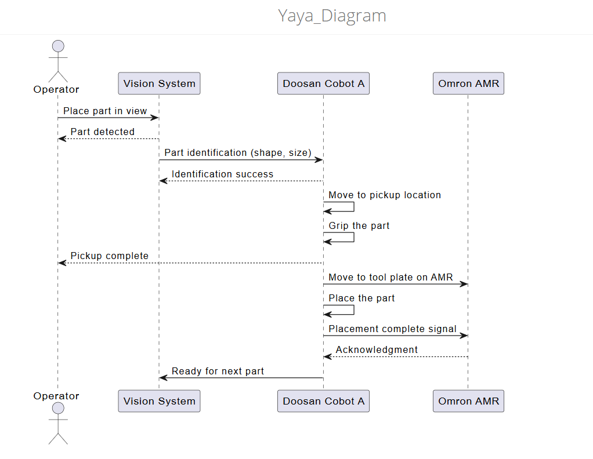

# Detailed Workflow for Doosan Cobot
In this chapter we want to highlight a specific sequence within the project. Sinse the projet is split into multiple parts that work together, this chapter would Get way to big if all sequences are highlited. For that reason, we have pickt one sequence we want to highlight. 

## Doosan pick & place

The Doosan Cobot task is to recognize parts of a hammer (square or rectangular) using a vision system and accurately place them on a tool plate on the Omron AMR.

## 2. Process Workflow
### 2.1 Part Recognition
- The Doosan Cobot A uses a Coral Dev Board vision system to analyze incoming hammer parts.
- It identifies whether the part is square or rectangular based on predefined parameters (size, shape, edges).
- The recognition result is used to determine the proper placement orientation.

### 2.2 Picking
- The cobot moves to the pickup location, guided by the recognition system.
- Using its gripper, it carefully picks the identified part.

### 2.3 Placement
- The cobot moves to the tool plate on the Omron AMR.
- Depending on the part type (square or rectangular), it places the part in the designated position.
- Ensures parts are aligned correctly to avoid interference during transport.

### 2.4 Communication with AMR
- The cobot sends a signal (via I/O or Ethernet/IP) to the AMR to indicate that the placement task is complete.
- Awaits confirmation from the AMR before starting the next cycle.

## 3. Components Involved

| Components                   | Function                                                            |
|------------------------------|--------------------------------------------------------------------|
| *Doosan Cobot A*          | Equipped with a multi-functional gripper and precise motion control. |
| *Coral Dev Board*         | Provides image processing capabilities for part recognition.         |
| *Tool Plate on AMR*       | Customized for securely holding square and rectangular parts.        |
| *I/O Module or Protocol*  | Facilitates signalling between the cobot and the AMR.               |

## 4. Inputs and Outputs

| Inputs                                  | Outputs                                   |
|----------------------------------------|------------------------------------------|
| *Input 1: Vision system data        | **Output 1*: Placement position and orientation for the gripper. |
| *Input 2: Signal from AMR           | **Output 2*: Signal to AMR (placement task completed).           |

## 5. Key Functional Requirements

- The vision system must achieve a recognition accuracy of at least *95%* for part identification.
- The cobot's placement tolerance must be within *±1 mm* to ensure stability during AMR transport.
- The process cycle time (recognition, pick, and place) should not exceed *15 seconds* per part.

## 6. Safety Measures

- Equipped with collision detection to ensure safe operation near humans and other equipment.
- Gripper equipped with a soft-touch mechanism to avoid damaging parts.
- Emergency stop button accessible for manual override.

## 7. Risks and Mitigation

### Risk 1: Misidentification of parts due to poor lighting or image quality
- *Mitigation*: Calibrate the vision system and ensure consistent lighting conditions.

### Risk 2: Improper placement on the tool plate, causing instability
- *Mitigation*: Program double-check alignment after placement.

 
In order to make it more visual, the following grapic is created: 

